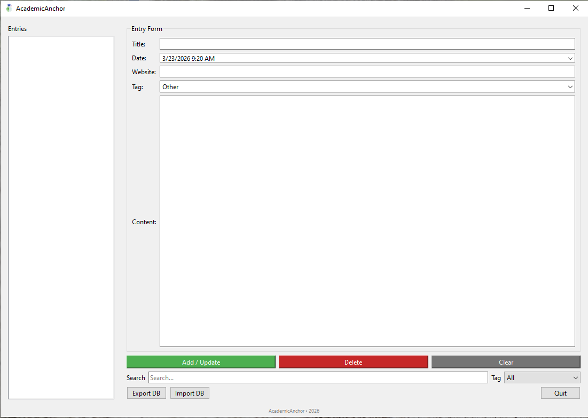

# 📚 AcademicAnchor  
### Version 1.0 – Local • Personal Knowledge Management  

---

## 🛡 About AcademicAnchor

**AcademicAnchor** is a **desktop personal knowledge management (PKM) tool** that allows you to securely store, organize, and manage notes, articles, research papers, and academic resources **locally on your machine**.  

It uses **SQLite** for local storage, ensuring your data is always on your device, and provides a **clean and modern PyQt6 interface** for quick access, filtering, and tagging.

---

## 🎯 Intended For

- 👤 Students and researchers needing **organized notes and resources**  
- 💻 Professionals managing **research, projects, and references**  
- 📚 Academics wanting **offline, fast-access knowledge management**  

---

## ⚡ Key Advantages

- 🖥 **Local Only** – Data never leaves your computer  
- 🏷 **Tag-Based Organization** – Categorize and color-code entries  
- 🔍 **Search & Filter** – Quickly find relevant notes  
- 🗂 **CRUD Operations** – Add, update, delete, and view entries  
- 💾 **Import / Export DB** – Backup or transfer your knowledge base  
- 💰 **Free & Open-Source** – Fully transparent, GPLv3 licensed  

---

## 🏗 Technical Architecture

**Data Flow:**
User Input → SQLite DB (local)
→ Title | Date | Website | Tag | Content
→ ListView display with colored tags
→ Export/Import as .db backup

---

## 📷 Application Screenshots

---

## 🛠 Features

- **Add / Update / Delete Entries** with metadata (title, date, website, tag, content)  
- **Search and Filter** by keyword or tag  
- **Color-coded tags** for visual organization  
- **Import / Export SQLite DB** for backup and portability  
- **Responsive PyQt6 interface** with footer  
- **Desktop & Start Menu shortcuts** via installer  

---

## ⚙ How to Use

1. Open **AcademicAnchor**.  
2. Use the **Entry Form** to add new notes or resources.  
3. Select existing entries from the **List** to view or edit.  
4. Use **Search** or **Tag Filter** to quickly locate entries.  
5. Use **Export DB** to back up your data.  
6. Use **Import DB** to restore or migrate your database.  
7. Clear the form using **Clear** when adding new entries.  

---

## 🔐 Privacy & Security Notes

- All data is **stored locally** in an SQLite database  
- No cloud or external storage is used  
- Tag colors and metadata are **only for personal organization**  
- Recommended to **backup your DB** regularly  

---

## 📝 License

This project is released under the **GPLv3 license**.  
You may use, modify, and redistribute it under the same license.

---

## 📚 AcademicAnchor – Organize, Search, Remember.
